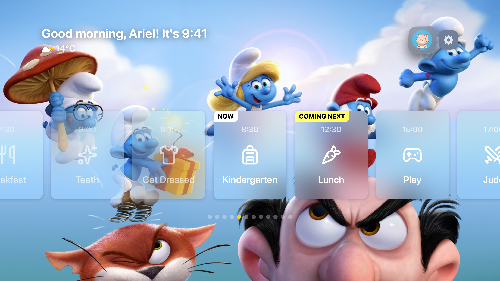
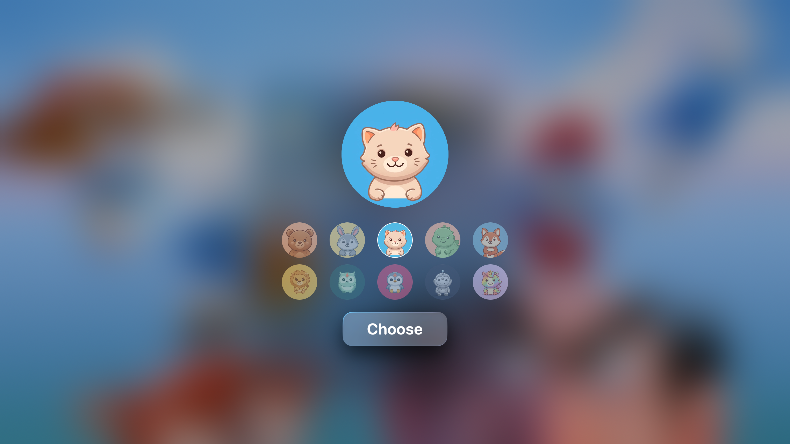
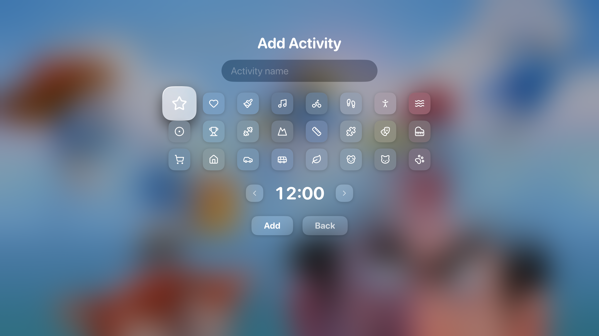
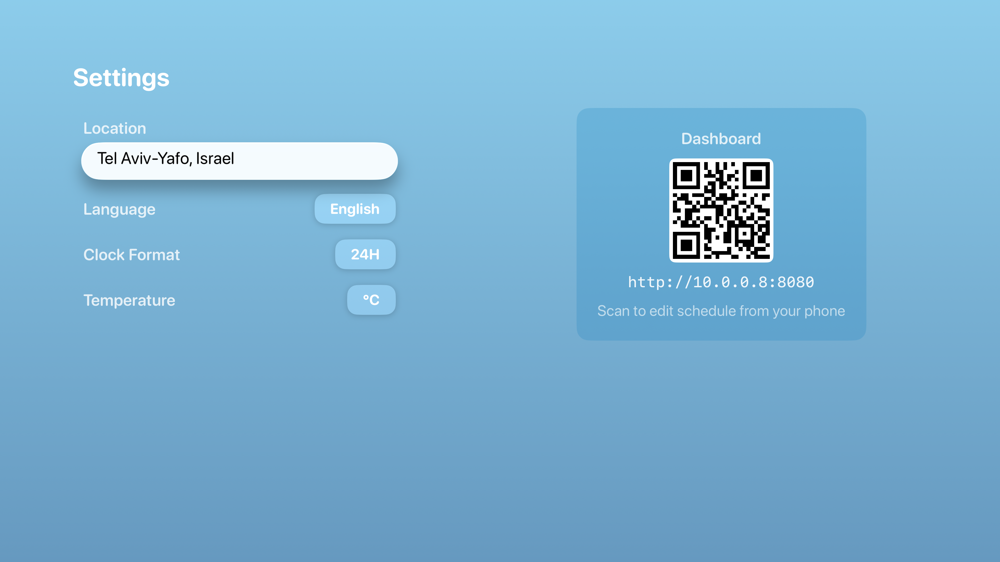
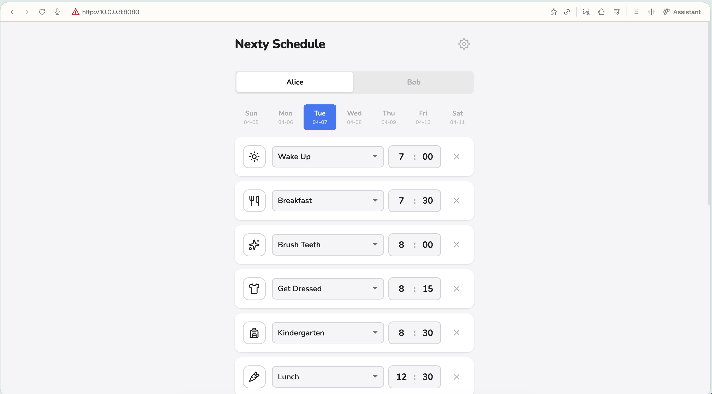

# nexty

<p align="center">
  <a href="https://github.com/talthent/nexty/actions/workflows/build.yml"></a>
  <a href="https://developer.apple.com/tvos/"></a>
  <a href="https://swift.org"></a>
  <a href="LICENSE"></a>
</p>

**A visual daily schedule app for Apple TV, built with love for my son.**

## How it started

My son is five years old and has ASD. He really likes to know what comes next. Transitions between activities can be hard when they feel unexpected, but when he can *see* his day laid out — what's happening now, what's coming next, and what the rest of the day looks like — everything becomes calmer. More predictable. More okay.

He also loves knowing the current time and checking the weather. These small pieces of information give him a sense of control over his world.

So I built **nexty** — a tvOS app that turns our living room TV into a gentle, glanceable daily schedule. It sits there on the biggest screen in the house, always visible, always ready to answer the question: *"What's next?"*

## What it does

- **Visual schedule rail** — Activities scroll horizontally with clear "Now" and "Coming Next" badges so there's never a question about where we are in the day
- **Time and weather** — Always visible in the header, because he always wants to know

<p align="center">
  
</p>

- **Multiple kid profiles** — Each child gets their own avatar, wallpaper, and schedule
- **Custom activities** — Add your own activities with custom icons and times

<p align="center">
  
  
</p>

- **Web dashboard** — Edit tomorrow's schedule from your phone by scanning a QR code — no need to navigate the TV UI with a remote
- **Weekly templates** — Set up a weekly routine once, and each day auto-loads the right schedule

<p align="center">
  
  
</p>

- **Bilingual** — Full English and Hebrew support with proper RTL layout
- **Top Shelf widget** — See current and next activities right from the tvOS home screen

## Design choices

Everything is designed for calm and clarity:

- **Big, simple cards** with icons from [Lucide](https://lucide.dev) — easy to read from across the room
- **Fun wallpapers and animated avatars** — because a schedule app for a five-year-old should feel joyful, not clinical
- **Minimal interaction** — the app shows what matters without requiring constant input. An idle timer auto-scrolls back to the current activity
- **No accounts, no internet required** — runs entirely on-device. The web dashboard works over your local network

## Tech

Built entirely in SwiftUI for tvOS. No external dependencies — just system frameworks.

- **State management** — Single `@Observable` `AppState` with derived read-only view states and action structs (`HomeActions`, `ProfileActions`). Views never mutate state directly.
- **Dashboard** — A lightweight HTTP server (`NWListener`) serves a bundled web UI (HTML/CSS/JS) for remote schedule editing
- **Persistence** — `UserDefaults` with shared app groups for the Top Shelf extension
- **Localization** — Type-safe `LocalizedStringKey` enum with per-language bundles and RTL layout support
- **Performance** — Async wallpaper decoding via `UIImage.byPreparingForDisplay()` to keep the main thread smooth
- **Weather** — Open-Meteo API with WMO weather code mapping to SF Symbols
- **Location** — `MKAddressRepresentations` for locale-aware city/country formatting
- **Testing** — 87 unit tests covering models, state logic, and services

```
nexty/
├── Models/        # Activity, Kid, Wallpaper, Language, view state structs
├── Services/      # AppState, DashboardServer, Weather, Location
├── Views/         # SwiftUI views — Home, Profile, Settings, Activity cards
├── Resources/
│   ├── Dashboard/ # Web dashboard (HTML, CSS, JS)
│   └── Videos/    # Animated avatar videos
topShelf/          # Top Shelf extension showing current/next activity
nextyTests/        # Unit tests (unit tests covering models and services)
```

## Running it

```bash
# Build
xcodebuild -scheme nexty -destination 'generic/platform=tvOS' build

# Or open in Xcode
open nexty.xcodeproj
```

Requires Xcode 26+ and a tvOS 26+ device or simulator.

## License

MIT
